# HTML Lanjutan (Membuat List,Table dan Form)


## Langkah-langkah Praktikum

Persiapan membuat dokumen HTML dengan nama file lab3_list.html seperti berikut.

```html
<!DOCTYPE html>
<html lang="en">
<head>
<meta charset="UTF-8">
<meta name="viewport" content="width=device-width, initial-scale=1.0">
<title>HTML Lanjutan</title>
</head>
<body>
<header>
<h1>Membuat List</h1>
</header>
</body>
</html>
```

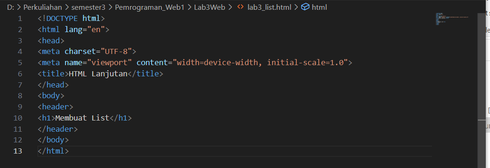


hasilnya akan seperti berikut :

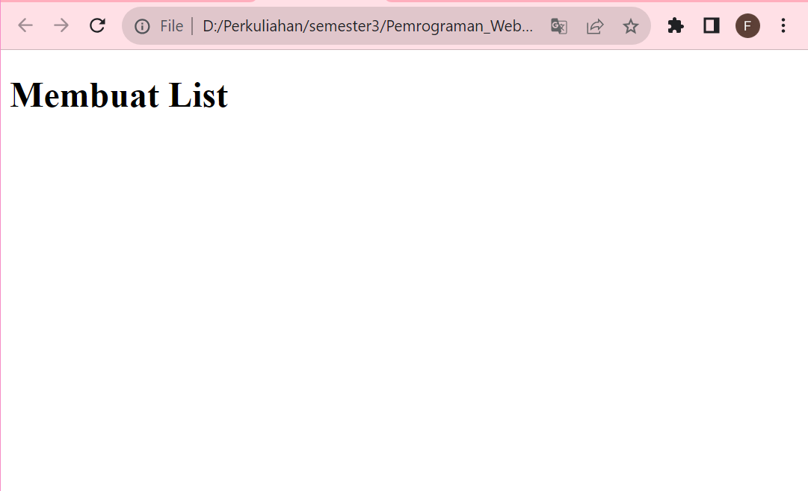


### Membuat Ordered List
Kemudian tambahkan kode untuk membuat Ordered List seperti berikut.

```html
<section id="order-list">
<h2>Ordered List</h2>
<ol>
<li>Pemrograman Web</li>
<li>Sistem Informasi</li>
<li>Basis Data 2</li>
</ol>
</section>
```

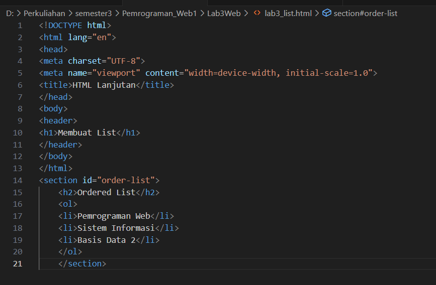

akan tampil seperti ini:

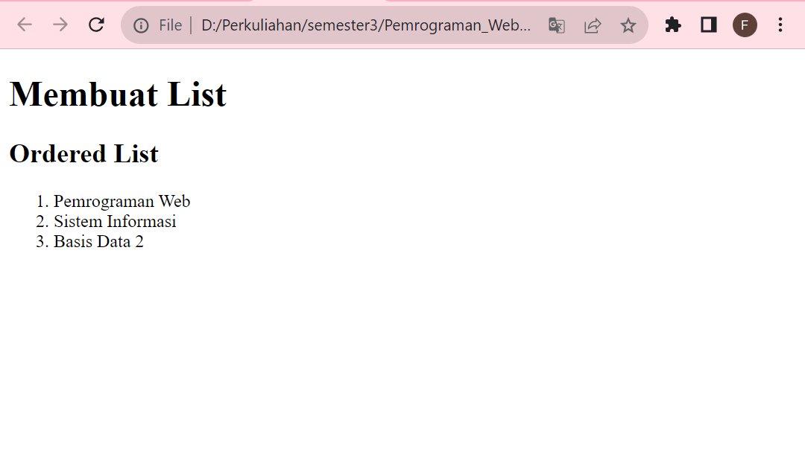


### Membuat Unorderd List
Kemudian tambakan kode untuk membuat Unordered List, setelah deklarasi ordered list pada section unordered-list, seperti berikut.

```html
<section id="unorder-list">
<h2>Unordered List</h2>
<ul type="square">
<li>Jaringan Komputer</li>
<li>Struktur Data</li>
<li>Algoritma &amp; Pemrograman</li>
</ul>
</section>
```


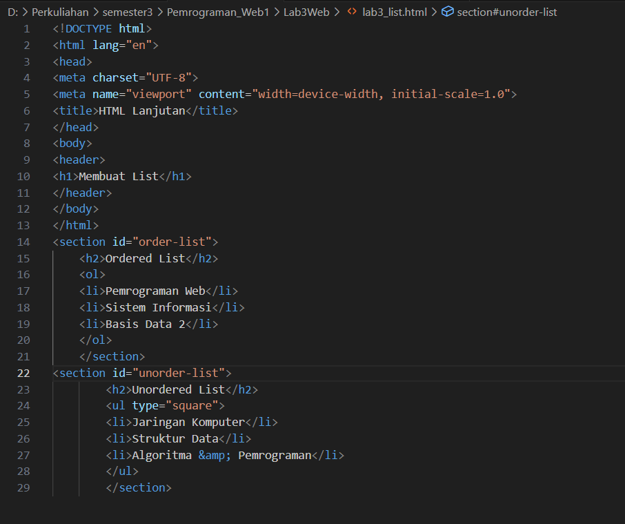

tampilannya menjadi :


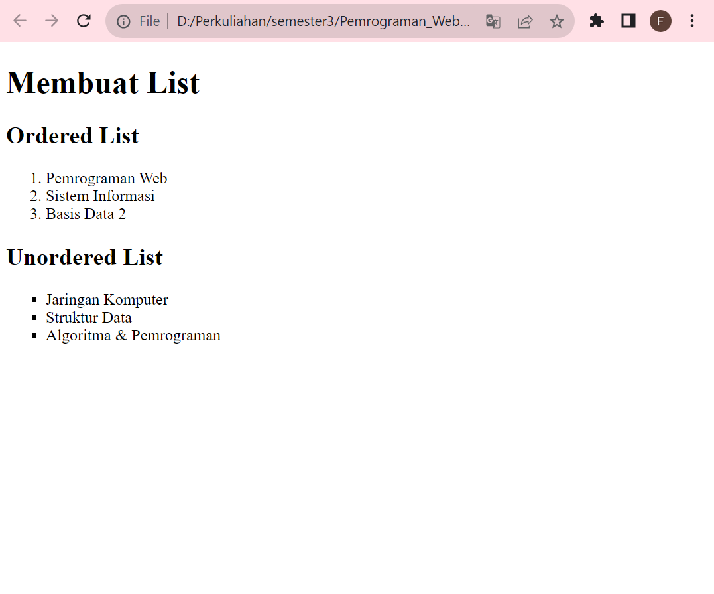


### Membuat Description List
Kemudian tambahkan kode untuk membuat description list setelah deklarasi unorderd-list.

```html
<section id="unorder-list">
<h2>Description List</h2>
<dl>
<dt>Fakultas Teknik</dt>
<dd>Teknik Industri</dd>
<dd>Teknik Informatika</dd>
<dd>Teknik Lingkungan</dd>
<dt>Fakultas Ekonomi dan Bisnis</dt>
<dd>Akuntansi</dd>
<dd>Manajemen</dd>
<dd>Bisnis Digital</dd>
</dl>
</section>
```

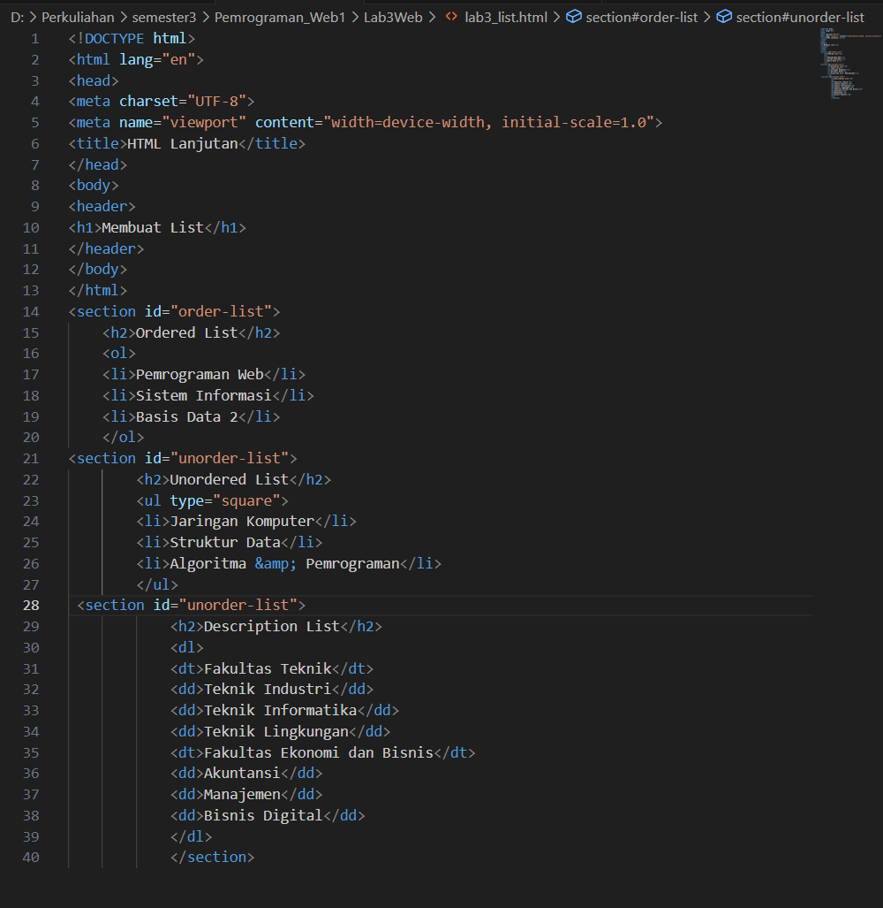


hasilnya:


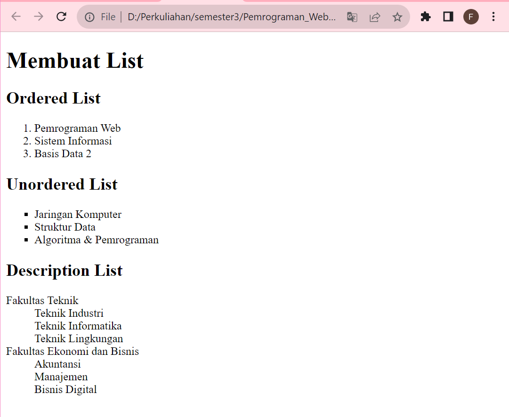


Selanjutnya lakukan eksperimen lain terkait list dan penggunaan atribut type pada list.

### Membuat Tabel
Buat file baru dengan nama lab3_tabel.html seperti berikut.

```html
<!DOCTYPE html>
<html lang="en">
<head>
<meta charset="UTF-8">
<meta name="viewport" content="width=device-width, initial-scale=1.0">
<title>HTML Lanjutan</title>
</head>
<body>
<header>
<h1>Membuat Table</h1>
</header>
</body>
</html>
```


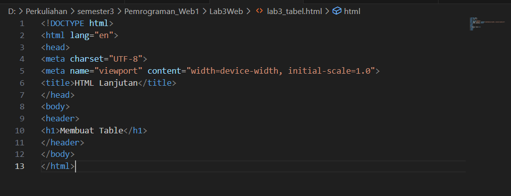


Kemudian selanjutnya tambahkan kode untuk membuat tabel sederhana seperti berikut:

```html
<table border="1" cellpadding="4" cellspacing="0">
<thead>
<tr>
<th>No.</th>
<th>Fakultas</th>
<th>Program Studi</th>
</tr>
</thead>
<tbody>
<tr>
<td>1.</td>
<td>Teknik</td>
<td>Teknik Informatika</td>
</tr>
<tr>
<td>2.</td>
<td>Teknik</td>
<td>Teknik Industri</td>
</tr>
<tr>
<td>3.</td>
<td>Teknik</td>
<td>Teknik Lingkungan</td>
</tr>
</tbody>
</table>
```

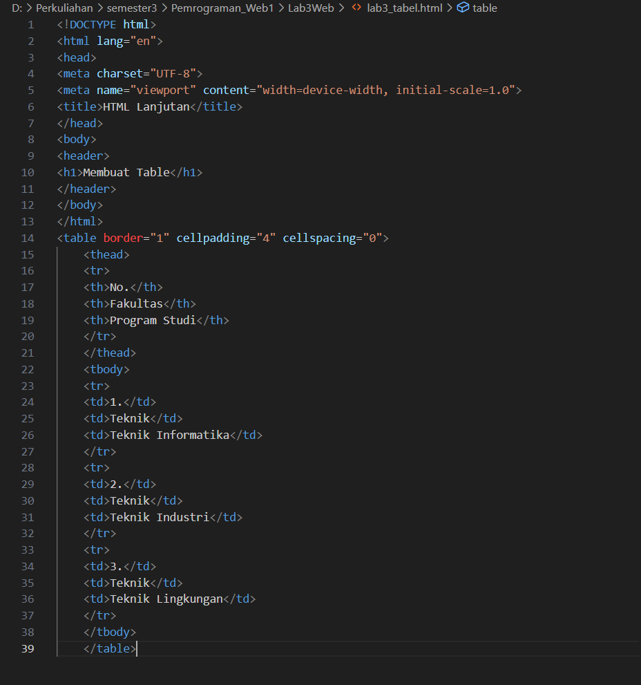

hasilnya :

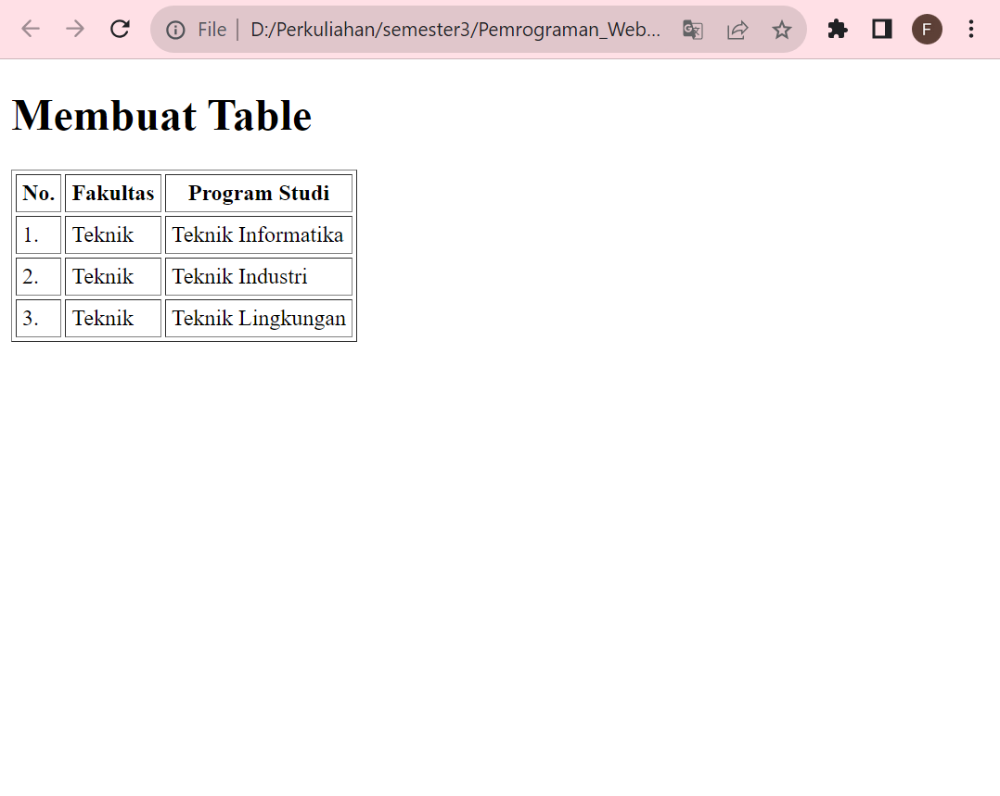


### Mengatur Margin dan Padding
Untuk mengatur margin dan padding pada cel data, tambahkan atribut cellpadding dan cellspacing pada tag table.

```html
<table border="1" cellpadding="4" cellspacing="0">
```

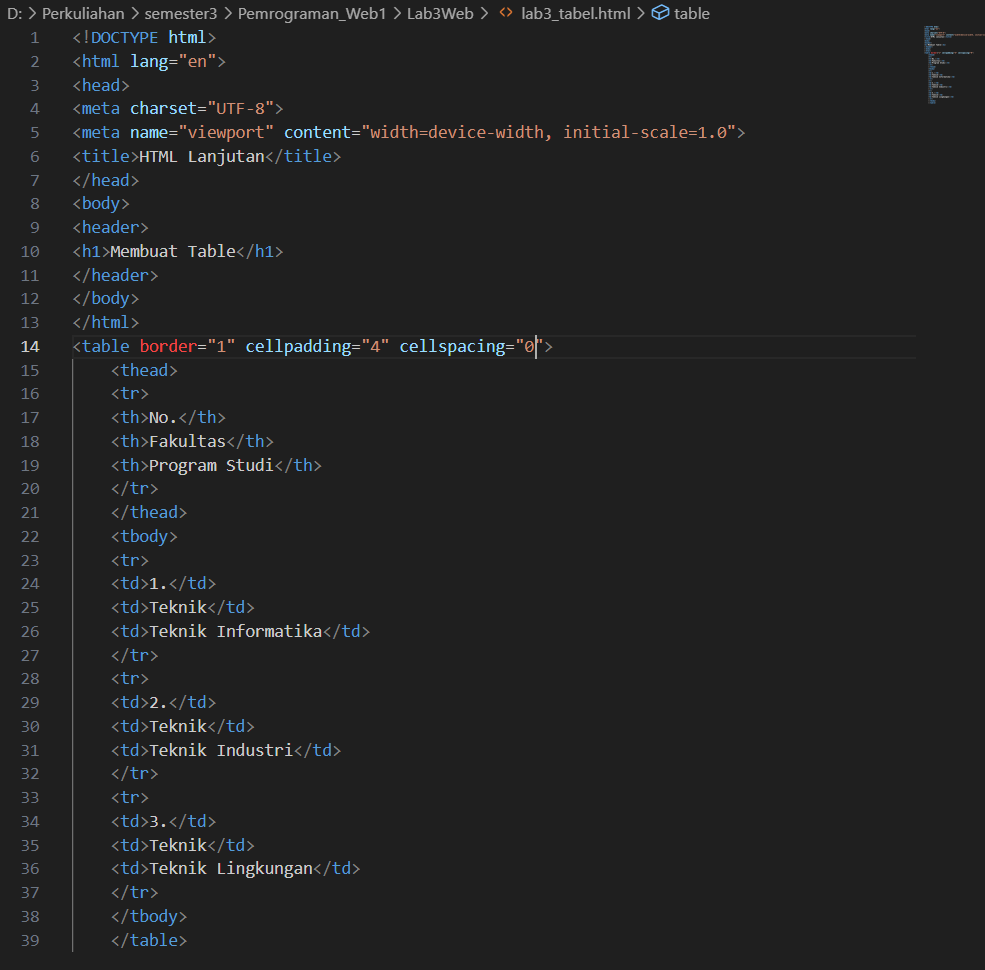


hasilnya:


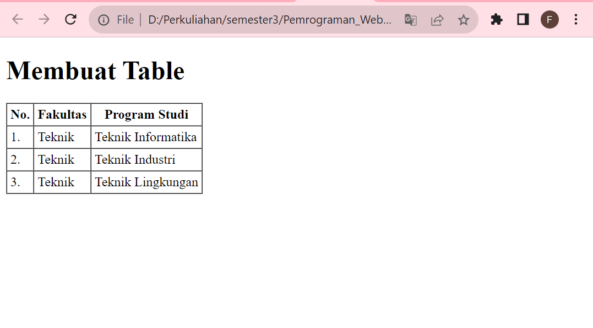


### Menggabungkan Sel Data
Untuk menggabungkan sel data, gunakan atribut rowspan dan colspan. Atribut rowspan untuk menggabungkan baris (secara vertikal) dan colspan untuk menggabungkan kolom (secara horizontal).

```html
<table border="1" cellpadding="6" cellspacing="0">
<thead>
<tr>
<th>No.</th>
<th>Fakultas</th>
<th>Program Studi</th>
</tr>
</thead>
<tbody>
<tr>
<td>1.</td>
<td rowspan="3">Teknik</td>
<td>Teknik Informatika</td>
</tr>
<tr>
<td>2.</td>
<td>Teknik Industri</td>
</tr>
<tr>
<td>3.</td>
<td>Teknik Lingkungan</td>
</tr>
</tbody>
</table>
```

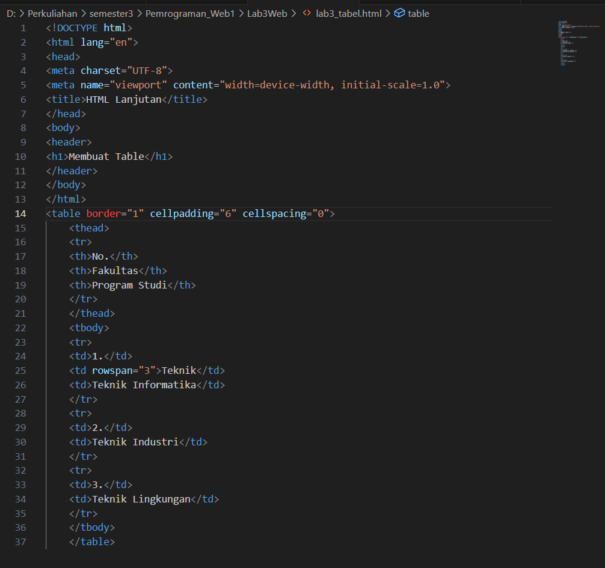


hasilnya:


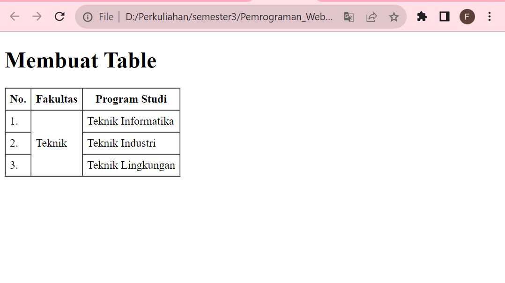


### Membuat Form
Buat file baru dengan nama lab3_form.html seperti berikut.

```html
<!DOCTYPE html>
<html lang="en">
<head>
<meta charset="UTF-8">
<meta name="viewport" content="width=device-width, initial-scale=1.0">
<title>HTML Lanjutan</title>
</head>
<body>
<header>
<h1>Membuat Form</h1>
</header>
</body>
</html>
```

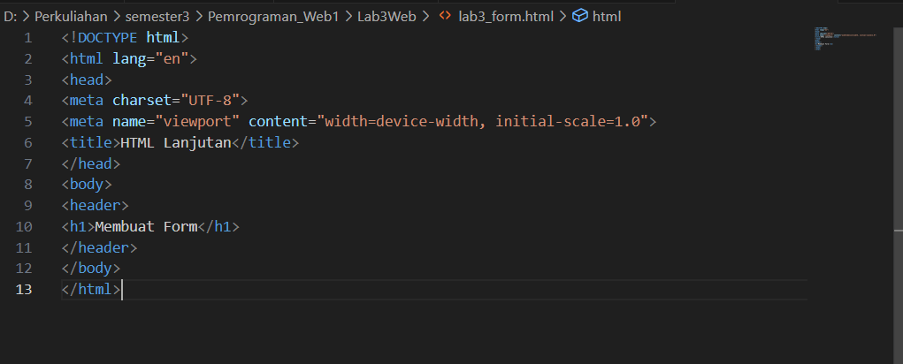


hasilnya :


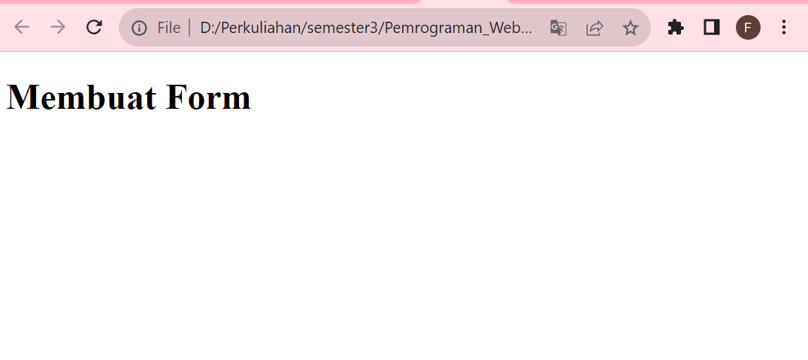


Kemudian selanjutnya tambahkan kode untuk membuat tabel sederhana seperti berikut:

```html
<form action="proses.php" method="post">
<fieldset>
<legend>Data Pelanggan</legend>
<p>
<label for="nama">Nama</label>
<input type="text" id="nama" name="nama">
</p>
<p>
<label for="alamat">Alamat</label>
<textarea id="alamat" name="alamat" cols="20" rows="3"></textarea>
</p>
<p>
<label>Jenis Kelamin</label>
<input id="jk_l" type="radio" name="kelamin" value="L" /><label
for="jk_l">Laki-laki</label>
<input id="jk_p" type="radio" name="kelamin" value="P" /><label
for="jk_p">Perempuan</label>
</p>
<p><input type="submit" value="Login"></p>
</fieldset>
</form>
```


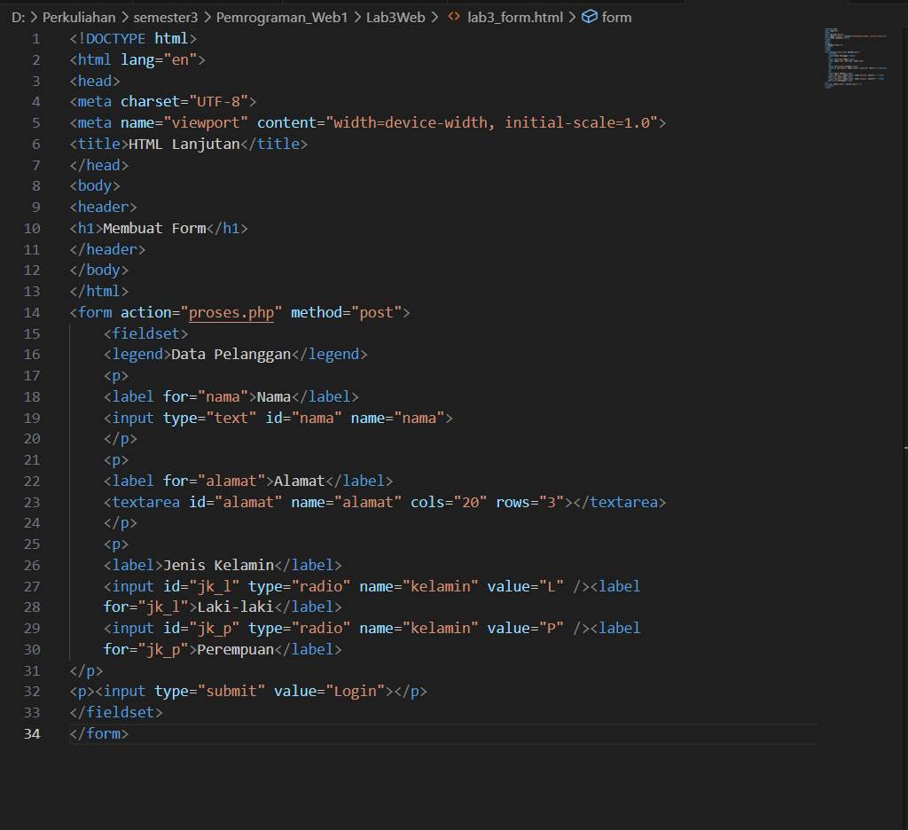


hasilnya:


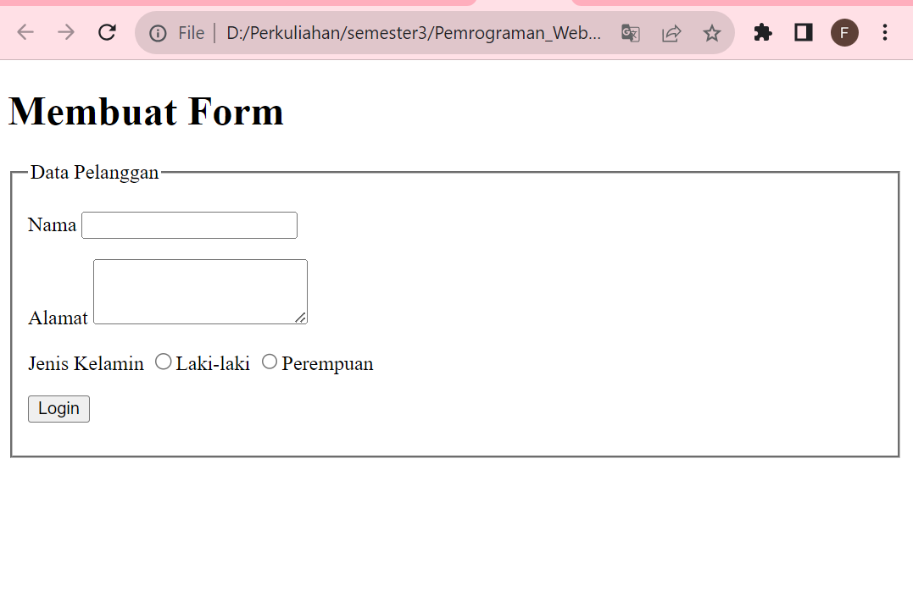


### Menabahkan Style pada Form
Agar tampilan form lebih menarik, bisa ditambahkan CSS seperti berikut.

```html
<style>
form p > label {
display: inline-block;
width: 100px;
}
form input[type="text"], form textarea {
border: 1px solid #197a43;
}
form input[type="submit"] {
border: 1px solid #197a43;
background-color: #197a43;
color: #ffffff;
font-weight: bold;
padding: 5px 15px;
}
</style>
```

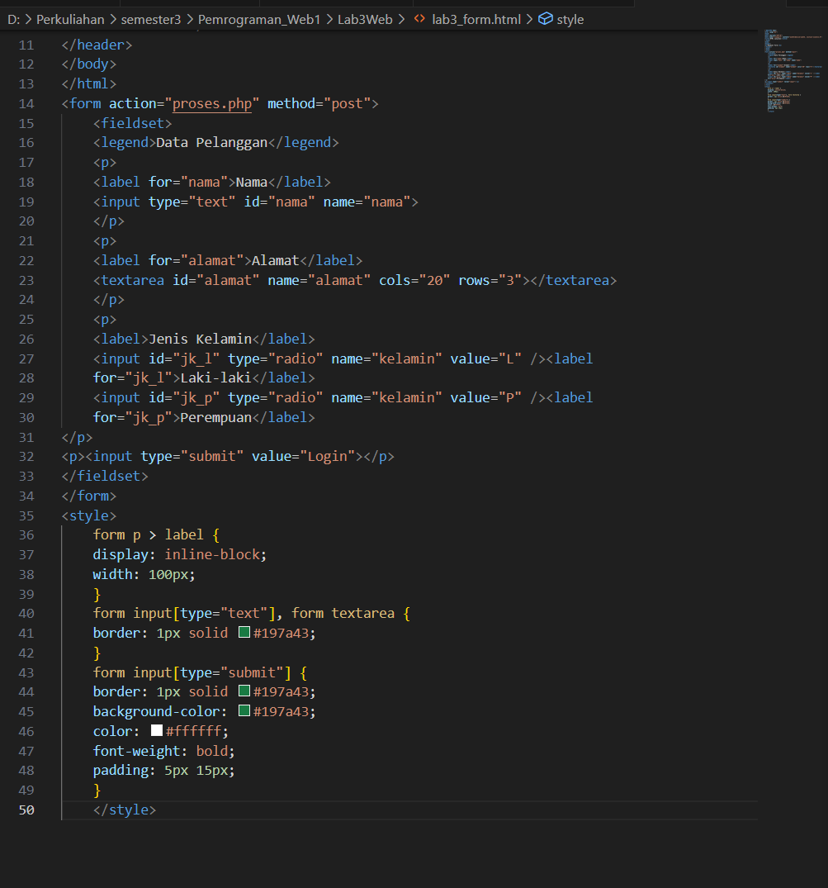


hasilnya:


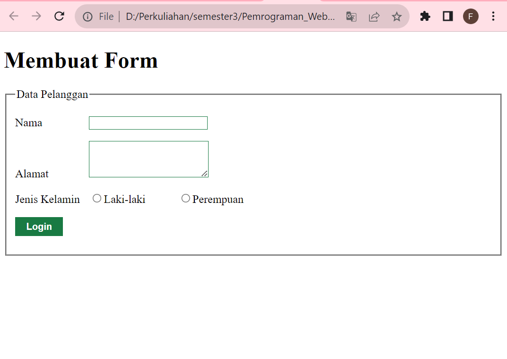


## Pertanyaan dan Tugas
1. Buatlah form yang menampilkan dropdown menu dan listbox dengan multiple selection.

```html
<!DOCTYPE html>
<html>
<head>
    <title>Form Dropdown dan Listbox</title>
</head>
<body>
    <h1>Pilih Buah-buahan Favorit Anda</h1>

    <form action="#" method="post">
        <label for="buah-dropdown">Pilih satu buah dari dropdown:</label>
        <select id="buah-dropdown" name="buah-dropdown">
            <option value="apel">Apel</option>
            <option value="pisang">Pisang</option>
            <option value="jeruk">Jeruk</option>
            <option value="mangga">Mangga</option>
        </select>
        <br>

        <label for="buah-listbox">Pilih beberapa buah dari listbox (tekan Ctrl untuk multiple selection):</label>
        <select id="buah-listbox" name="buah-listbox" multiple>
            <option value="apel">Apel</option>
            <option value="pisang">Pisang</option>
            <option value="jeruk">Jeruk</option>
            <option value="mangga">Mangga</option>
            <option value="anggur">Anggur</option>
            <option value="kiwi">Kiwi</option>
        </select>
        <br>

        <input type="submit" value="Submit">
    </form>
</body>
</html>
```

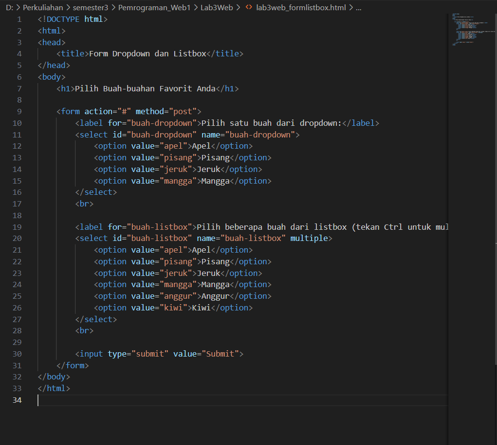

hasilnya :

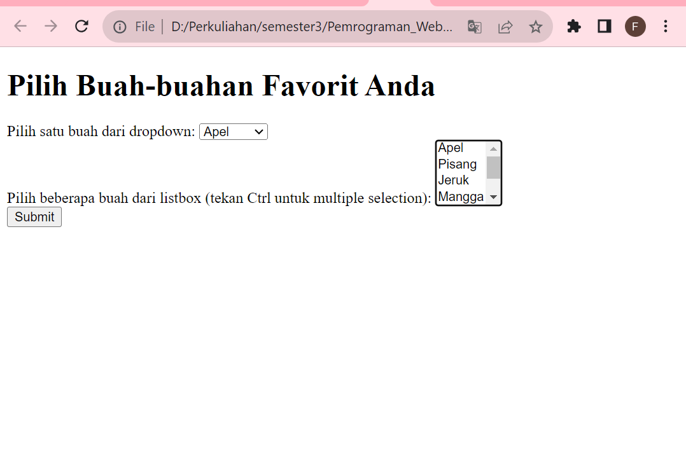


## Laporan Praktikum
1. Buatlah repository baru dengan nama Lab3Web.
2. Kerjakan semua latihan yang diberikan sesuai urutannya.
3. Screenshot setiap perubahannya.
4. Buatlah file README.md dan tuliskan penjelasan dari setiap langkah praktikum beserta
screenshotnya.
5. Commit hasilnya pada repository masing-masing.
6. Kirim URL repository pada e-learning ecampus
